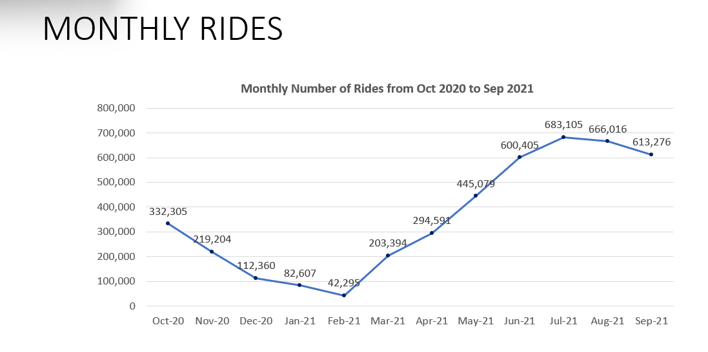
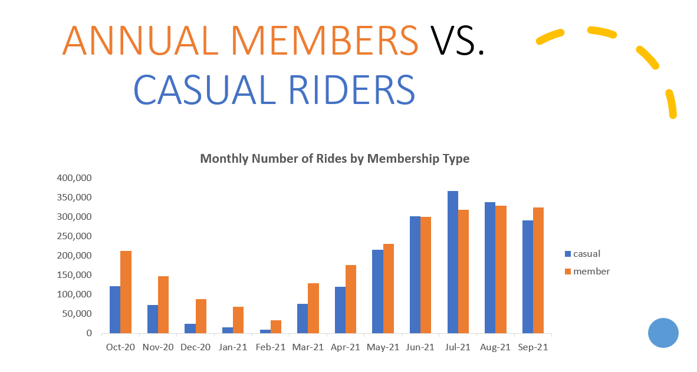
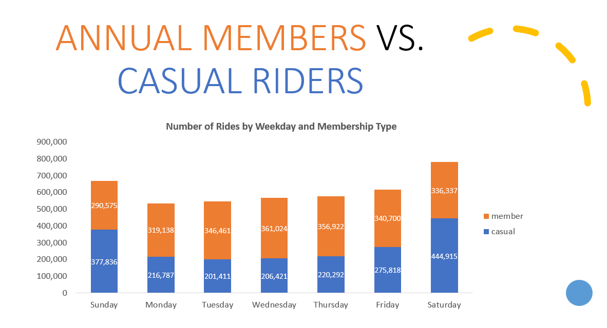
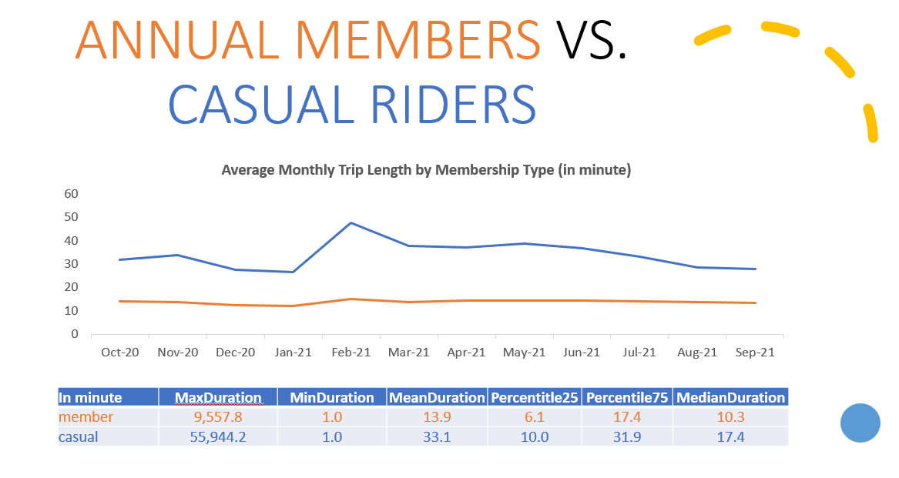
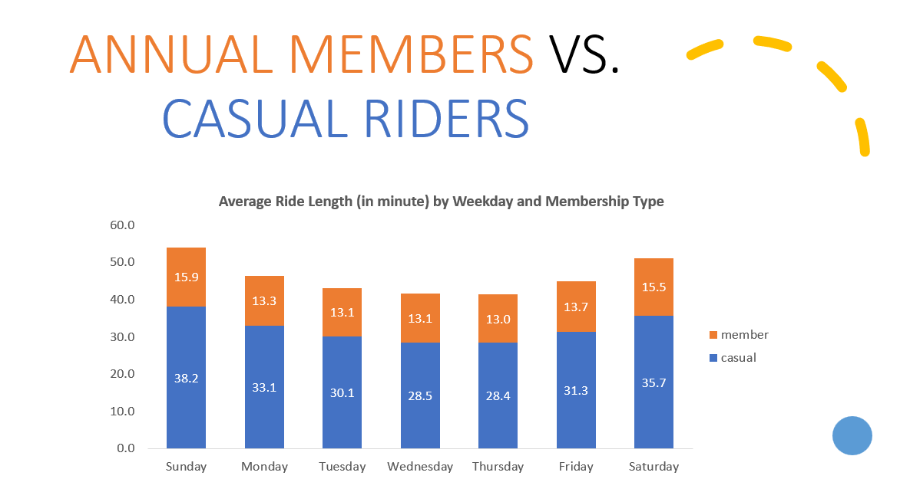
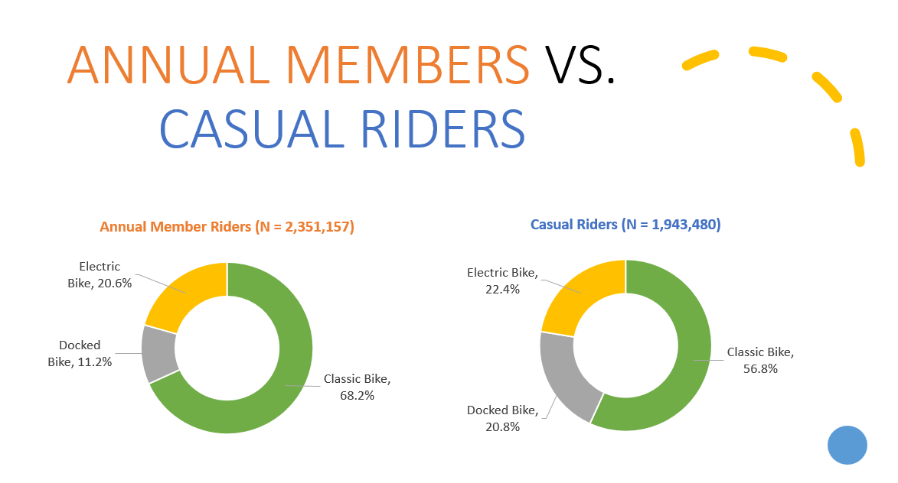

# Bike_sharing_project
This is my capstone project for the Google Data Analytics certificate from Coursera.

## Background

Cyclistic is a ficticious company looking for ways to grow its business.  The Director of Marketing, Lily Moreno, believes the company's future depends on maximizing the number of annual memberships.  Cyclistic has a bike-share program that features more than 5,800 bicycles and over 600 docking stations.

Cyclistic bikes can be unlocked from one station and returned to station in the system anytime.  Until now, Cyclistic's marketing strategy relied on building general awareness and appealing to broad consumer segments.  Unlocking the bikes involves offering single-ride passes, full-day passes, and annual memberships.  Customers who purchase single-ride or full-day passes are referred to as casual riders.  Customers who purchase annual memberships are Cyclistic members.

Cyclistic's finance analysts determined that annual members are much more profitable than casual riders.  Although our current pricing flexibility helps Cyclistic attract more customers, Moreno believes that maximizing the number of annual members is the key to future growth.  Rather than creating a marketing campaign that targets all-new customers, Moreno believes there is a very good chance to convert existing casual riders into members.  Casual riders are already familiar with the Cyclistic program and have chosen Cyclistic for their mobility needs.

## 1. "Ask"
The questions that the stakeholders want answer in this scenario are:
    1. How do annual members and casual riders use Cyclistic bikes differently?
    2. Why would casual riders buy Cyclistic annual memberships?
    3. How can Cyclistic use digital media to influence casual riders to become members?

## 2. "Prepare" 
Data Source: Data is downloaded at [Divvy Trip Data](https://divvy-tripdata.s3.amazonaws.com/index.html).  To get a good idea of rider trends, I downloaed and analyzed 12 months of data (October 2020 through September 2021).  

## Data Dictionary:

* ride_id -- unique identifer of a particular bike trip
* rideable_type -- type of bike used (classic pedal, pedal assist bikes aka e-bikes)
* started_at -- date and time the bike trip was removed from a dock
* ended_at -- date and time the bike trip was returned to a dock
* start_station_name -- location of the starting docking station
* start_station_id -- alphanumeric identifier of the starting dock
* end_station_name -- location of the ending docking station
* end_station_id -- alphanumeric identifier of the ending dock
* start_lat -- latitude of the starting docking station
* start_lng -- longitude of the starting docking station
* end_lat -- latitude of the ending docking station
* end_lng -- longitude of the ending docking station
* member_casual -- type of rider (casual rider or member)

More information about the data set can be found at:  [City of Chicago Data Portal for Divvy Trips](https://data.cityofchicago.org/Transportation/Divvy-Trips/fg6s-gzvg).  Information regarding systematic changes to the dataset can also be found at:  [City of Chicago Open Data Portal](http://dev.cityofchicago.org/open%20data/data%20portal/2019/12/17/divvy-datasets-revived.html).

[List of current bike stations.](https://data.cityofchicago.org/Transportation/Divvy-Bicycle-Stations/bbyy-e7gq)

## 3."Process"
Each data set is a comma-separated value (CSV) text file and was imported into a Microsoft SQL Server database, where I wrote SQL queries to clean and combine data.  Results from the queries were exported to an Excel spreadsheet for creating charts.

Data cleaning procedure:
1. Calculate:
    - the length of time for each trip
    - the day of the week the trip occurred
2. Remove records:
    - where the start time was later than the end time
    - where the length of the ride is less than one minute to account for the fact it may be due to testing or bike docking readjustment
    - test data
3. Identify and remove missing data:
    -  where the start or end station identifier is missing
    - where the longitude or latitude was not recorded
4. Check for duplicated rows

## 4."Analyze"

  
Casual riders vs. annual member

  
  
  
  
  
  

## 5."Summary"
Casual riders and annual member riders have different purposes of using the bike service. Casual riders are more likely to use the bikes for long/ weekend trips while annual member riders have a consistent short routine.

Summer months and classic bikes are popular in demands among two groups.

## 6."Recommendations"
Offer different tier memberships (routine vs casual/ weekend use) + Offer a rewards program as an incentive for converting to members.

Hold events/promotions during the summer months and weekends.

Use digital media platforms for marketing campaigns and promotion events.

